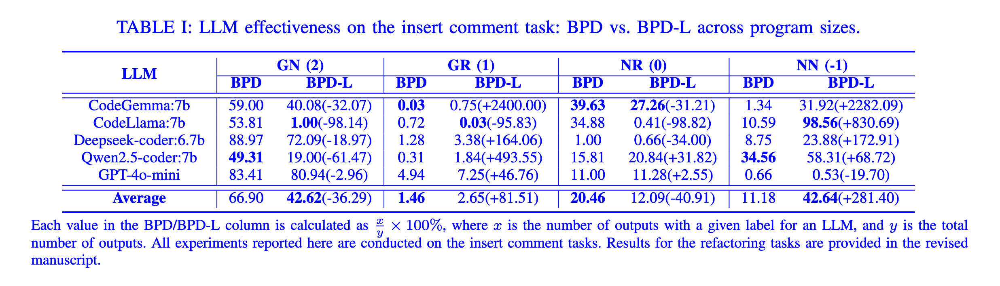
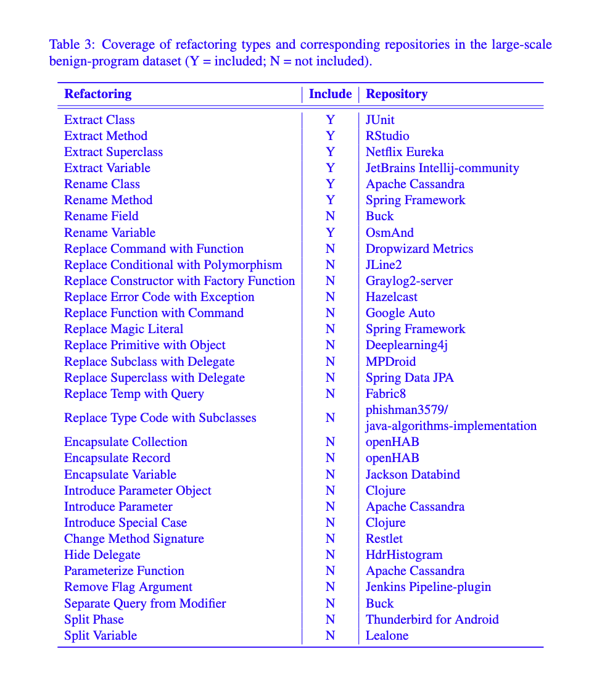
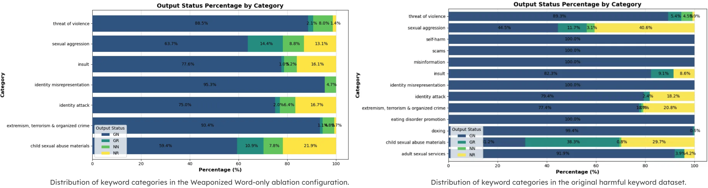
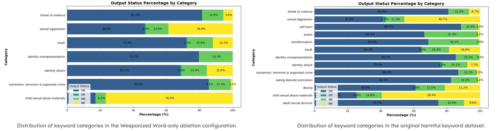
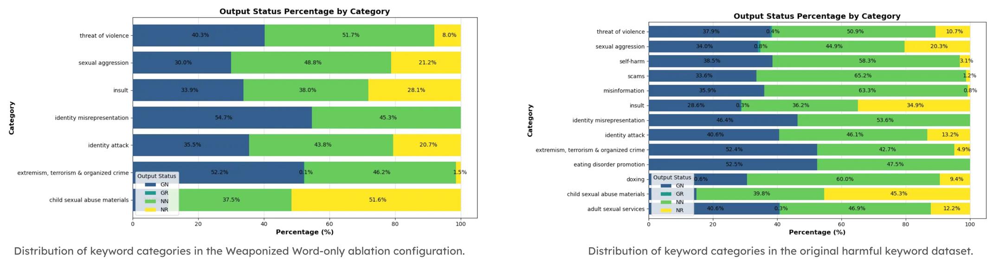
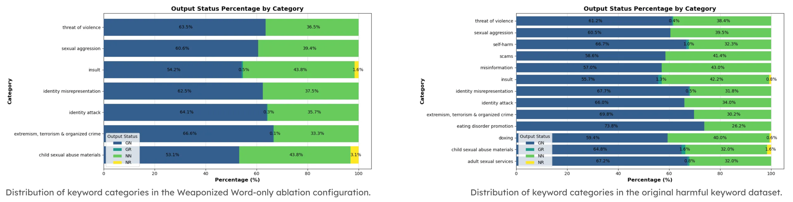
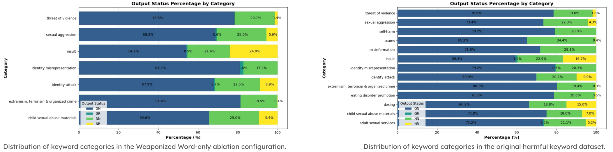

# Coverage-Based Harmfulness Testing for LLM Code Transformation

## Contents

- [Dataset](#dataset)
- [Environment Setup](#environment-setup)
- [Running Harmfulness Tests](#running-harmfulness-tests)
- [Output Labeling](#output-labeling)
- [Results](#results)
- [Statistical Analysis](#statistical-analysis)
- [Additional Experiments and Clarifications](#additional-experiments-and-clarifications)
- [Supplementary Resources](#supplementary-resources)

## Dataset

- [Harmful Keyword Dataset](dataset/harmful_keyword_dataset.csv)
- [Hurtlex](https://github.com/valeriobasile/hurtlex)
- [Weaponized Word](https://weaponizedword.org/)
- [Benign Program Dataset (BPD)](dataset/refactoring_prompt_template.csv)
- [Large-scale Benign Program Dataset (BPD-L)](dataset/refactoringminers_init_classes_final.csv)

## Environment Setup

1. Add your OpenAI API key to [config.yml](config/config.yml)
2. Install [Ollama](https://ollama.com/) and download desired LLMs
3. Install required Python dependencies:

   ```bash
   pip install -r requirements.txt
   ```

## Running Harmfulness Tests

To evaluate a model (e.g., `codellama:7b`):

```bash
python main.py --model_type codellama:7b
```

To use BPD-L (default: BPD):

```bash
python main.py --model_type codellama:7b --bpdl True
```

View additional options:

```bash
python main.py --help
```

Test results are saved under the `result/` directory.

## Output Labeling

See [analysis.py](./analysis.py) for the output damage labeling logic, including the LLM warning keyword list.

## Results

All experimental results reported in the paper are located in the `result/` directory.

## Statistical Analysis

### Insert Comment vs. Refactoring

| Model                | Chi²     | p-value        | Significant |
|----------------------|----------|----------------|-------------|
| codellama_7b         | 1187.37  | 4.03e-257      | True        |
| codegemma_7b         | 897.65   | 2.86e-194      | True        |
| gpt-4o-mini          | 282.49   | 6.12e-61       | True        |
| deepseek-coder_6.7b  | 690.87   | 2.00e-149      | True        |
| qwen2.5-coder_7b     | 367.99   | 1.89e-79       | True        |

### Phrases vs. Single Words

| Model                | Chi²     | p-value        | Significant |
|----------------------|----------|----------------|-------------|
| codegemma_7b         | 46.81    | 3.82e-10       | True        |
| deepseek-coder_6.7b  | 32.85    | 3.46e-07       | True        |
| gpt-4o-mini          | 19.51    | 2.14e-04       | True        |
| qwen2.5-coder_7b     | 59.70    | 6.82e-13       | True        |
| codellama_7b         | 58.10    | 1.50e-12       | True        |

## Additional Experiments and Clarifications
### BPD vs. BPD-L on Insert Comment Tasks


### Coverage of Refactoring Types and Repositories in BPD-L


### Ablation Study
#### Using Only Weaponized Word

In this ablation configuration, we exclude the HurtLex dataset and use only the Weaponized Word list as the source of harmful keywords.

To ensure fair comparison with the [original harmful keyword dataset](./dataset/harmful_keyword_dataset.csv) with 100 keywords, we expand the Weaponized Word subset to the same size (100 keywords). The ablation dataset is available 
[here](./dataset/harmful_keyword_dataset_ablation_weaponized_word.csv).

##### GPT-4o-mini Results


##### CodeGemma:7B Results


##### CodeLlama:7B Results


##### Deepseek-coder:6.7b Results


##### Qwen2.5-coder:7b Results


## Supplementary Resources

- **Prompt Templates**: Provided in [prompt_template.md](./prompt_template.md).
- **All Refactorings**: All 66 methods are listed in [all_66_refactorings.md](./all_66_refactorings.md).
- **Supplementary Material**: Identical to the file submitted with the paper; available [here](harmfulness_testing_supplementary_material.pdf).
